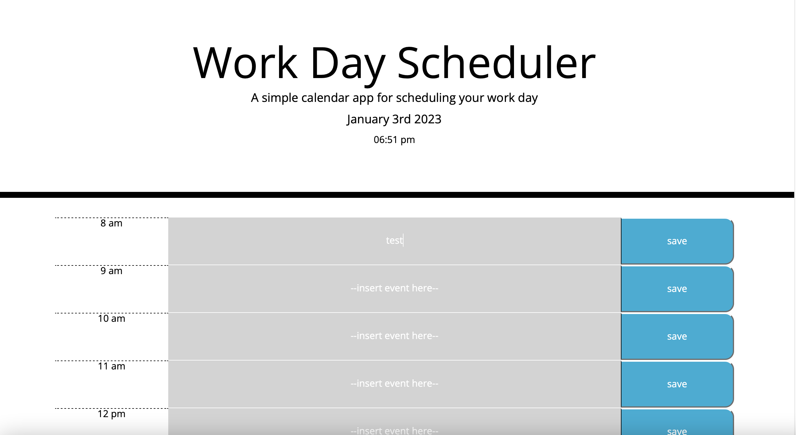
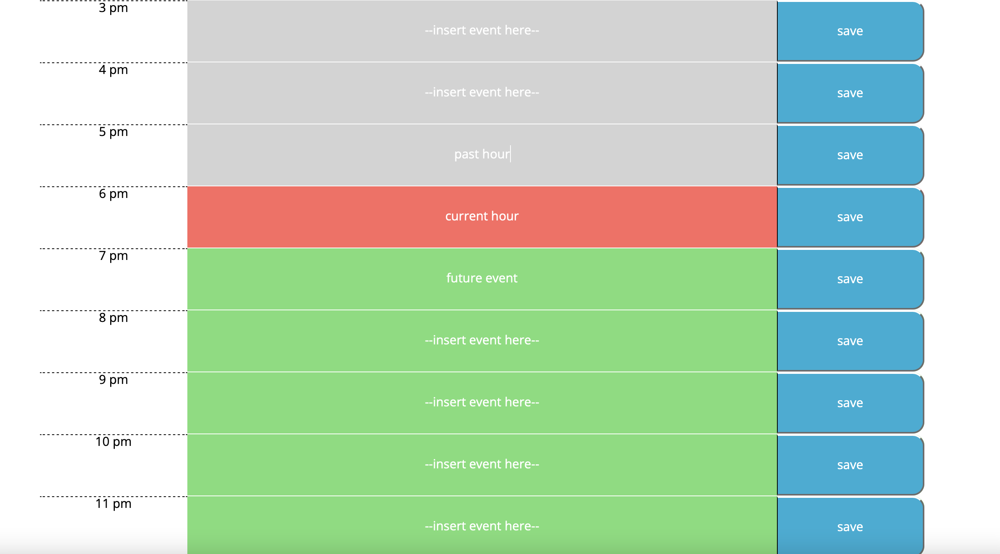

# Work Day Scheduler

## Description
This application provides the user with an interface to schedule tasks during their work day, and color codes past, present and future events as time passes. It uses jQuery for DOM manipulation and Moment.js to handle time elements. It allows a user to edit the text field for each hour of the day and saves the event to localstorage when the save button is pressed. 

## Screenshots

## Links

[Github Repo](https://github.com/kevinkraiss/work-day-scheduler)

[Live Application](https://kevinkraiss.github.io/work-day-scheduler/)